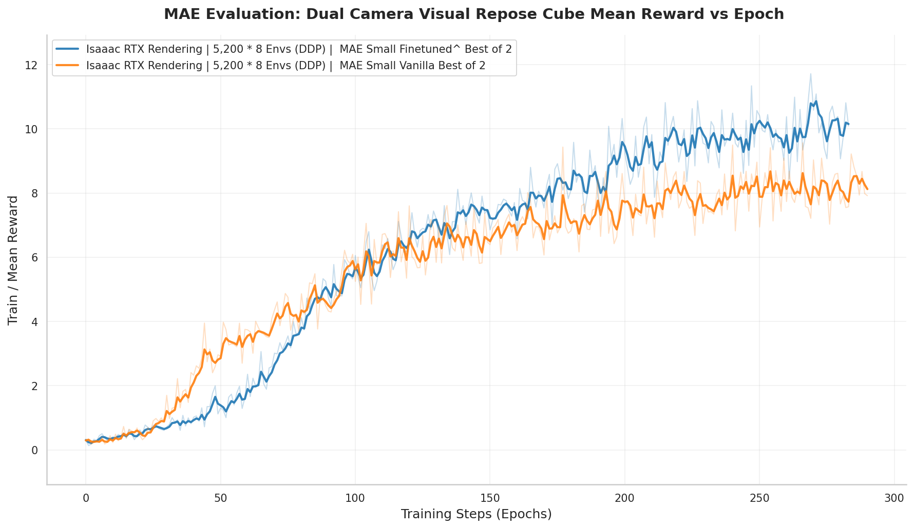
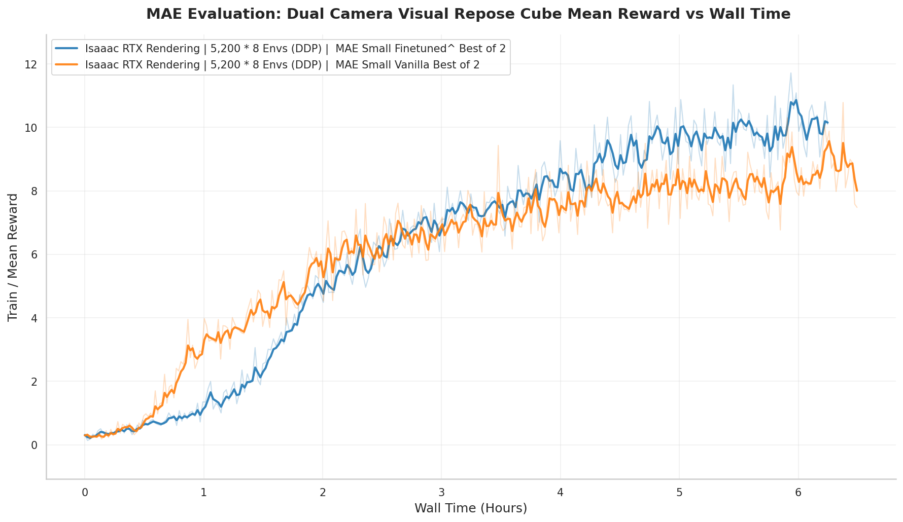
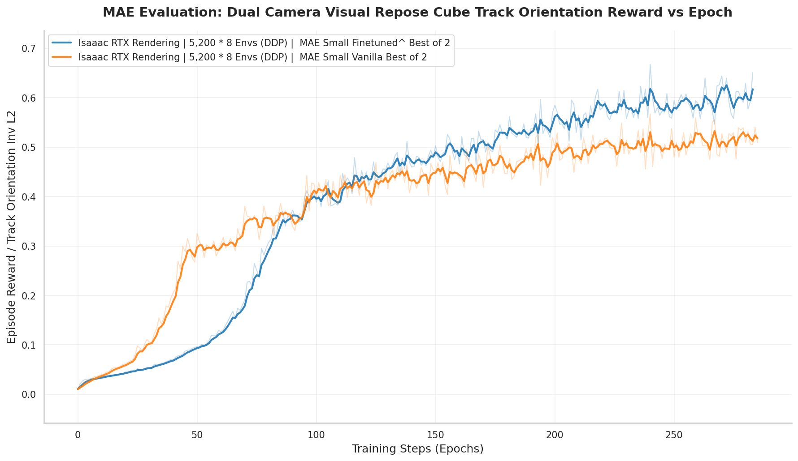
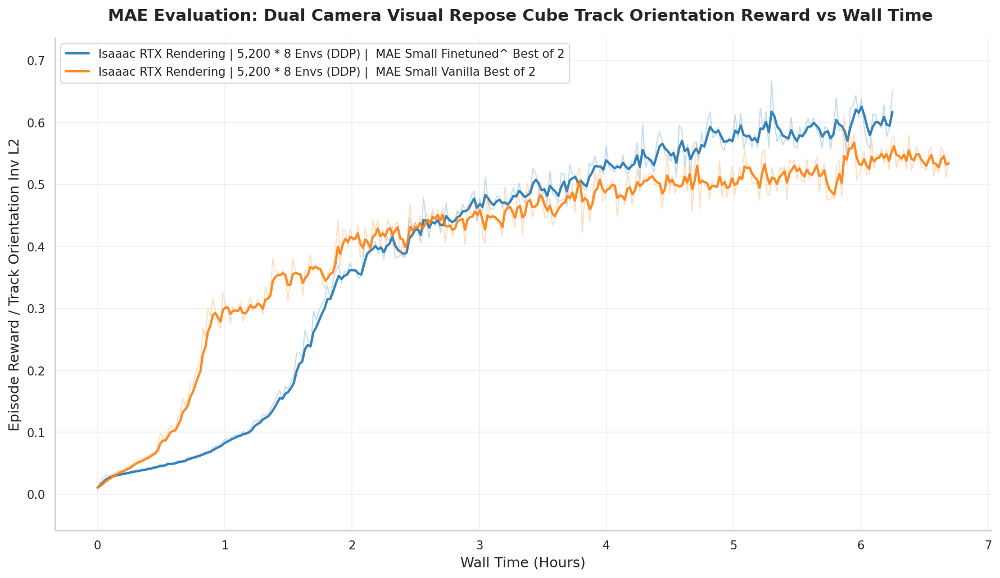
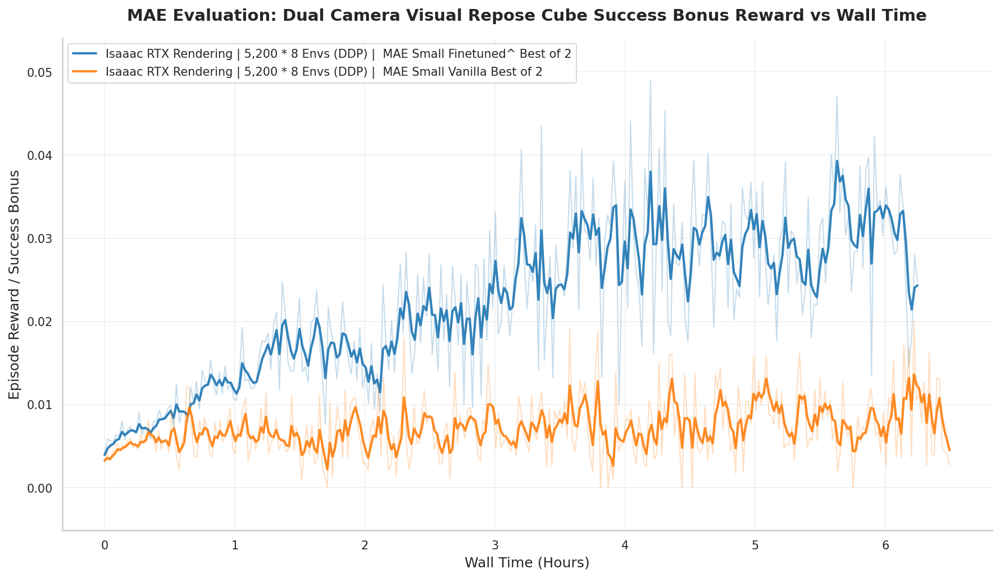

# HandEye: Pretrained Vision Encoders for Dexterous Manipulation

**Jay Grieve** & **Gary Lvov**
Brown University

This repository contains the code for training and evaluating vision backbones for dexterous manipulation, as described in our paper.

## Abstract

We investigate how adapting large pretrained vision encoders (MAE) to egocentric manipulation data affects downstream performance on:
1. **Action recognition** in egocentric video (EPIC-Kitchens)
2. **Vision-based RL** for in-hand cube reorientation

Our key finding: egocentric adaptation yields **competitive recognition** but **stronger control**—the primary benefit is improved *control-relevant* perception rather than semantic classification.

## Key Results

### Action Recognition (EPIC-Kitchens)

| Training / Initialization Strategy | Top-1 Acc. (%) |
|-----------------------------------|----------------|
| Random initialization | 27.06 |
| Full training on Ego10K | 34.76 |
| Continued pretraining on EPIC-Kitchens + full finetuning | 35.78 |
| Frozen initial layers, Ego10K domain adapted | 35.20 |
| Frozen initial layers, EPIC-Kitchens domain adapted | 38.06 |
| ImageNet pretraining only | **38.20** |

### Vision-Based Cube Reorientation (IsaacLab)

Despite similar recognition accuracy, egocentric-adapted encoders show improved performance for vision-based RL:

<p align="center">


</p>
<p align="center"><i>Mean reward vs. training epoch (left) and wall time (right)</i></p>

<p align="center">


</p>
<p align="center"><i>Orientation tracking reward vs. epoch (left) and wall time (right)</i></p>

<p align="center">


</p>
<p align="center"><i>Success bonus vs. epoch (left) and wall time (right)</i></p>

## Takeaways

1. **Preserve generic pretraining**: ImageNet initialization + freezing early layers is critical
2. **Training from scratch underperforms**: Egocentric data alone doesn't replace diverse pretraining
3. **Recognition ≠ Control**: Standard action recognition metrics don't predict manipulation performance
4. **Best recipe**: ImageNet init → freeze early layers → adapt later layers on egocentric data

## Installation

```bash
python -m venv .venv
source .venv/bin/activate
pip install -r requirements.txt
```

## Usage

### MAE Pretraining

```bash
# Train MAE on egocentric frames
python train_mae.py --data_dir ./frames --output_dir ./mae_output --epochs 200

# Continued pretraining with frozen initial layers (recommended)
python train_mae_frozen.py --data_dir ./frames --output_dir ./mae_output_frozen \
    --pretrained_encoder imagenet --freeze_blocks 6 --epochs 50
```

### Linear Probing (EPIC-Kitchens)

```bash
python linear_probe.py --checkpoint ./mae_output/checkpoint-0199.pth \
    --data_dir ./epic_kitchens --epochs 100 --batch_size 256
```

### DINOv3 Baseline

```bash
HF_TOKEN=your_token python probe_dinov3.py --data_dir ./epic_kitchens --model vitb16
```

## Data

- **Ego10K**: Egocentric factory footage from [Egocentric-100K](https://huggingface.co/datasets/nvidia/Egocentric-100K)
- **EPIC-Kitchens**: Kitchen activity dataset for evaluation

Frame extraction scripts handle deduplication via DINOv3 embedding similarity.

## Citation

```bibtex
@inproceedings{grieve2025handeye,
  title={HandEye: Pretrained Vision Encoders for Dexterous Manipulation},
  author={Grieve, Jay and Lvov, Gary},
  booktitle={ICML},
  year={2025}
}
```

## License

MIT
